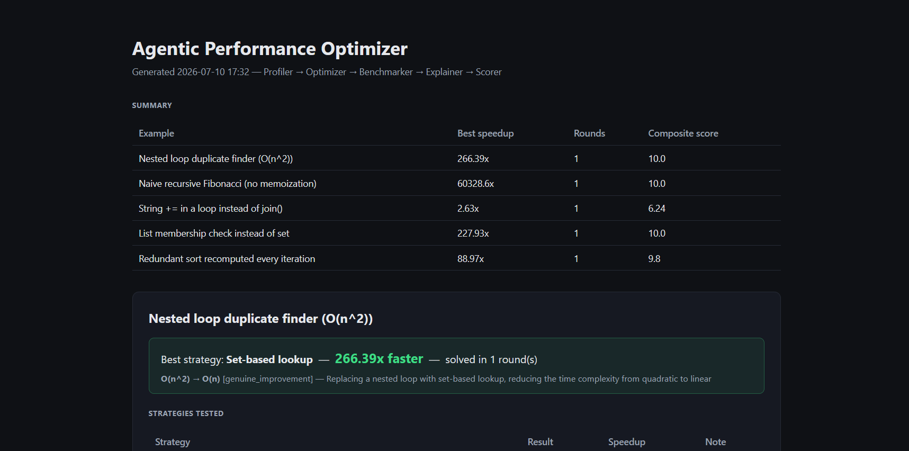
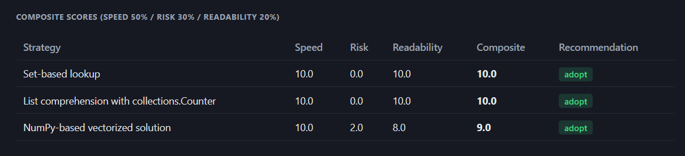
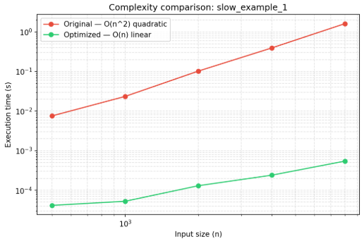

# Agentic Performance Optimizer

A multi-agent system that takes slow Python code and makes it faster — automatically, with proof. Every claim it makes ("this is faster", "this is correct", "this is safe") is backed by real code execution and measurement, not by trusting an LLM's opinion.



## Why this project

Most "AI does X" demos are a single LLM call with a clever prompt, dressed up as a "system." This project is built the opposite way: every step that *can* be verified by actually running code, is — and the LLM is only trusted for the steps that genuinely require judgment (proposing an approach, judging readability, judging risk). The result is a pipeline where a claimed 300x speedup isn't a guess — it's a number produced by running both versions of the code and timing them.

## The agents

| Agent | Role | Input → Output | Uses LLM? |
|---|---|---|---|
| **Profiler** | Runs the code with `cProfile` on a real input and reports the actual bottlenecks | source file + args → `{baseline_time, bottlenecks, raw_stats}` | No — real execution only |
| **Optimizer** | Proposes 2-3 genuinely different optimization strategies targeting those bottlenecks | code + profiler report → `[{name, explanation, code}, ...]` | Yes (Groq / Llama 3.3 70B) |
| **Benchmarker** | Executes the original and every candidate on the same input, checks outputs are identical, measures real speedup | original + candidate code → `{passed, outputs_match, speedup, error}` | No — real execution only |
| **Explainer** | Independently justifies *why* a strategy is faster, purely in terms of algorithmic complexity (Big-O) — a second opinion, separate from the Optimizer's own reasoning | original + optimized code → `{original_complexity, optimized_complexity, mechanism, verdict}` | Yes |
| **Scorer** | Produces a composite score (speed 50% / risk 30% / readability 20%) and rejects candidates that are fast but risky | code + timings → `{speed_score, risk_score, readability_score, composite_score, recommendation}` | Speed: deterministic math. Risk/readability: LLM |

### Why 5 agents instead of 2-3

A 3-agent pipeline (Profiler → Optimizer → Benchmarker) is enough to produce a working optimization loop, and it's the core of this system — everything else is built on top of it. Two more agents were added deliberately, each solving a distinct problem the 3-agent version doesn't:

- **The Optimizer explaining its own work is not independent verification.** An LLM justifying its own output can be self-serving or hand-wavy. The **Explainer** is a separate LLM call whose only job is to independently critique the complexity claim — it can and does disagree (e.g. flag a change as only a constant-factor improvement rather than a real complexity win).
- **"Passed the benchmark" isn't the same as "safe to adopt".** When the Optimizer proposes multiple strategies, more than one can legitimately pass the Benchmarker (correct output + faster). Picking between them by speed alone would happily adopt a fast-but-fragile rewrite. The **Scorer** exists specifically to catch that case — it can flag a fast, benchmark-passing candidate as `reject` for being too risky, which the orchestrator then genuinely honors when picking a winner (see `orchestrator.py`, the eligibility filter excludes `reject`-flagged candidates even if their composite score is high).

Each of the 5 agents has one narrow, non-overlapping responsibility, and the two "extra" agents each close a specific correctness/trust gap that the base pipeline leaves open — rather than being duplicated or cosmetic roles.

## How agents communicate

Every handoff is a structured dict/JSON, never raw text:

```
Profiler      → { baseline_time, bottlenecks, raw_stats }
Optimizer     → [ { name, explanation, code }, ... ]            (one per strategy)
Benchmarker   → { passed, outputs_match, speedup, error }         (per candidate)
Explainer     → { original_complexity, optimized_complexity, mechanism, verdict }
Scorer        → { speed_score, risk_score, readability_score, composite_score, recommendation }
```

## The pipeline

```
Profiler (measure real bottlenecks)
        │
Optimizer (propose 2-3 strategies)
        │
Benchmarker (test every strategy: correctness + real speed)
        │
Explainer (complexity justification, passing strategies only)
        │
Scorer (composite score: speed + risk + readability)
        │
Winner = highest composite score, among PASSED and NOT flagged "reject"
        │
   if nothing qualifies → single-strategy retry loop (up to 3 rounds, fed the Benchmarker's failure as feedback)
```

## Example results



| Bottleneck type | Fix applied | Speedup observed |
|---|---|---|
| O(n²) nested loop (duplicate finder) | Set-based lookup | ~220–350x |
| Exponential recursive recomputation (Fibonacci) | Memoization / iterative | ~7,000–60,000x |
| O(n²) string concatenation (`+=` in a loop) | Build a list, `''.join()` once | ~2–5x |
| O(n·m) list membership checks | Convert to `set` | ~170–430x |
| Invariant recomputed every loop iteration | Hoist computation out of the loop / precompute index | ~2–90x |

The spread is intentional and honest: not every bottleneck has room for a 100x fix. Some are fundamental complexity-class changes (huge gains), others are constant-factor improvements (modest but real). The Explainer's `verdict` field distinguishes these explicitly rather than presenting every result as an equally dramatic win.

## Empirical complexity verification (Big-O, not just wall-clock time)

Beyond raw speedup, the system can empirically estimate the *algorithmic complexity* of the original and optimized code — not just "it got faster on this one input," but "it now scales differently as input size grows."

**How it works:** the code is run on several increasing input sizes (e.g. 500, 1000, 2000, 4000, 8000), timing each with `timeit`. Since `time ≈ C · n^k`, taking the log of both sides gives `log(time) = log(C) + k · log(n)` — a straight line whose slope *is* the complexity exponent `k`. A linear regression on `log(size)` vs `log(time)` recovers that slope directly (see `agents/complexity.py`), which is then mapped to a familiar label (slope ≈ 2 → O(n²), slope ≈ 1 → O(n), etc.).



**To reproduce this chart yourself:**
```bash
python orchestrator.py examples/slow_example_1.py 2000          # produces optimized/slow_example_1_optimized.py
python analyze_complexity.py examples/slow_example_1.py --sizes 500 1000 2000 4000 8000
# → writes complexity_charts/slow_example_1_complexity.png
```

## How to run

```bash
pip install -r requirements.txt
```
Create a `.env` file in the project root:
```
GROQ_API_KEY=your_key_here
```

```bash
# Run the full pipeline on a single example
python orchestrator.py examples/slow_example_1.py 2000

# Run all 5 examples with a summary table
python run_all.py

# Generate the full HTML report (re-runs everything, writes report.html)
python generate_report.py

# Verify the feedback/retry loop in isolation (no API calls, fully mocked)
python test_retry_loop.py

# Empirically estimate Big-O complexity + generate a before/after chart
python analyze_complexity.py examples/slow_example_1.py --sizes 500 1000 2000 4000 8000
```

## Project structure

```
agents/
  profiler.py       # cProfile-based profiling (no LLM)
  optimizer.py      # LLM proposes 1 or N optimization strategies
  benchmarker.py    # runs candidates, compares correctness + speed (no LLM)
  explainer.py      # LLM independently justifies speedup via algorithmic complexity
  scorer.py         # composite score: speed (deterministic) + risk/readability (LLM)
  complexity.py     # empirical Big-O estimation via log-log regression (no LLM)
orchestrator.py     # wires the full pipeline + retry loop
run_all.py          # runs all 5 examples, prints summary table
generate_report.py  # runs all 5 examples, writes a self-contained HTML report
build_report_offline.py  # rebuilds report.html from already-saved results, no API calls
analyze_complexity.py    # Big-O comparison chart for one example
test_retry_loop.py   # isolated test proving the feedback/retry loop works (mocked)
llm_client.py        # Groq API wrapper, with JSON-repair fallback
examples/            # 5 example scripts, each with a different bottleneck type
optimized/           # winning optimized code, saved after each successful run
complexity_charts/   # generated Big-O comparison charts (PNG)
assets/              # screenshots used in this README
```

## Challenges encountered

- **JSON parsing fragility.** The LLM sometimes wraps generated code in Python-style triple quotes (`"""..."""`) instead of valid JSON string escaping, or emits raw newlines inside JSON strings. Fixed with a repair step in `llm_client.py` (regex-based triple-quote conversion, plus `strict=False` parsing).
- **Type mismatches across strategies.** A NumPy-based candidate returned an array, and `==` on arrays returns an element-wise array rather than a plain bool — this crashed the Benchmarker's comparison. Fixed with a `_safe_equals()` helper that handles array-like results generically.
- **Composite score ceiling effect.** The Scorer's speed score saturates at 10/10 above ~50x speedup, so a 230x and a 470x candidate can tie on composite score even though one is meaningfully faster. This is a deliberate tradeoff (so raw speed doesn't dominate readability/risk past a "fast enough" point) but is worth knowing when reading the scores.
- **A high-risk candidate could silently win.** Early on, the orchestrator picked the highest composite score among benchmark-passing candidates without checking the Scorer's own `reject` recommendation — meaning a candidate the Scorer itself flagged as risky could still be adopted if it scored well numerically. Fixed by excluding `reject`-flagged candidates from the winner selection entirely.
- **Empirical complexity noise on very fast code.** On code that runs in microseconds, measurement noise distorts the estimated Big-O slope. Larger input sizes are needed to get a clean signal (see the sizes used in `analyze_complexity.py` examples).
- **API rate limits.** Multi-strategy + Explainer + Scorer means significantly more LLM calls per example than a single-agent version. `build_report_offline.py` exists specifically so the HTML report can be rebuilt from already-obtained real results without needing further API calls.

## What we'd improve with more time

- Extend beyond Python (the profiling/execution layer would need to be swapped per language; the agent architecture itself would carry over largely unchanged)
- Migrate the hand-built orchestration to a framework (LangGraph / CrewAI) and compare what it provides for free versus what it complicates
- Make the Scorer's weights (speed/risk/readability) configurable per use case instead of fixed defaults
- Let the Explainer's complexity estimate feed back into the Scorer directly, instead of being purely informational